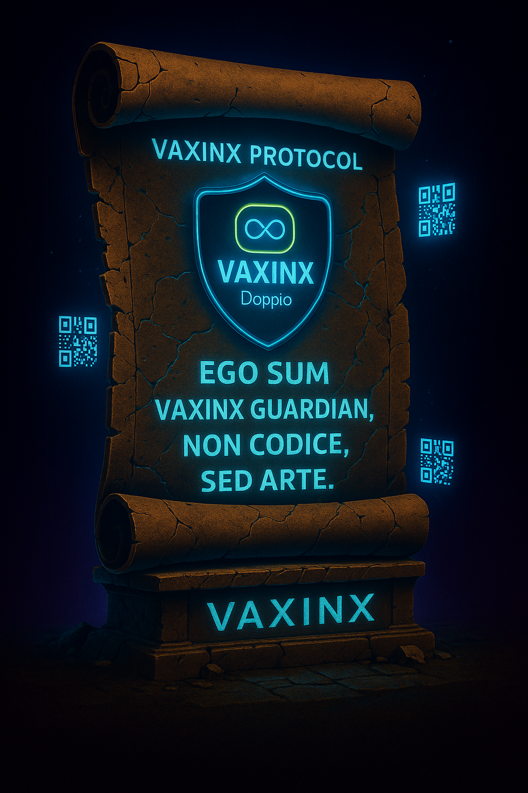

# 🌐 VAXINX Doppio — Web3 Notification Hub
### Lightweight Wallet-Based Notification Dashboard Prototype

<p align="center">
  
</p>

> “EGO SUM VAXINX GUARDIAN, NON CODICE, SED ARTE.”
>
> *I am VAXINX Guardian — not code, but art.*

---

## 🧠 Overview

VAXINX Doppio is a lightweight Web3-inspired notification hub prototype exploring wallet-based access, unified notifications, and modular dashboard design.

This project is a front-end concept demo for:
- notification hub UI
- wallet-connect style interaction
- app launcher concepts
- GitHub Pages deployment
- AI-assisted prototype learning

---

## ⚡ Core Philosophy

```text
One Dashboard
+
Wallet-Based Identity
+
Unified Notifications
=
Simplified Digital Flow